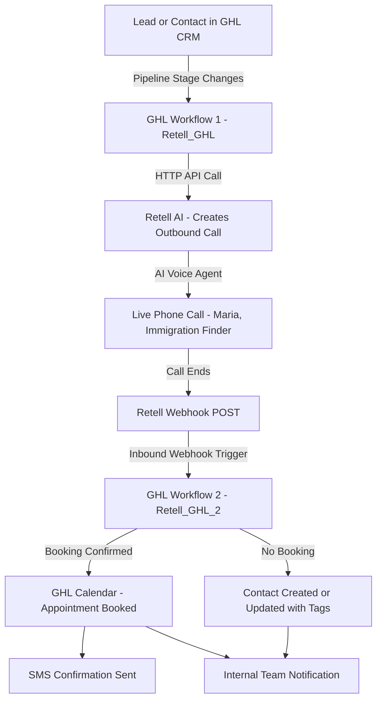
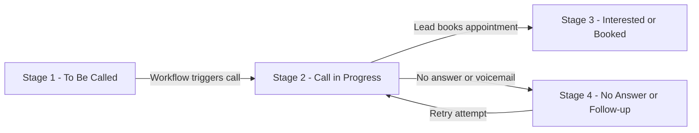
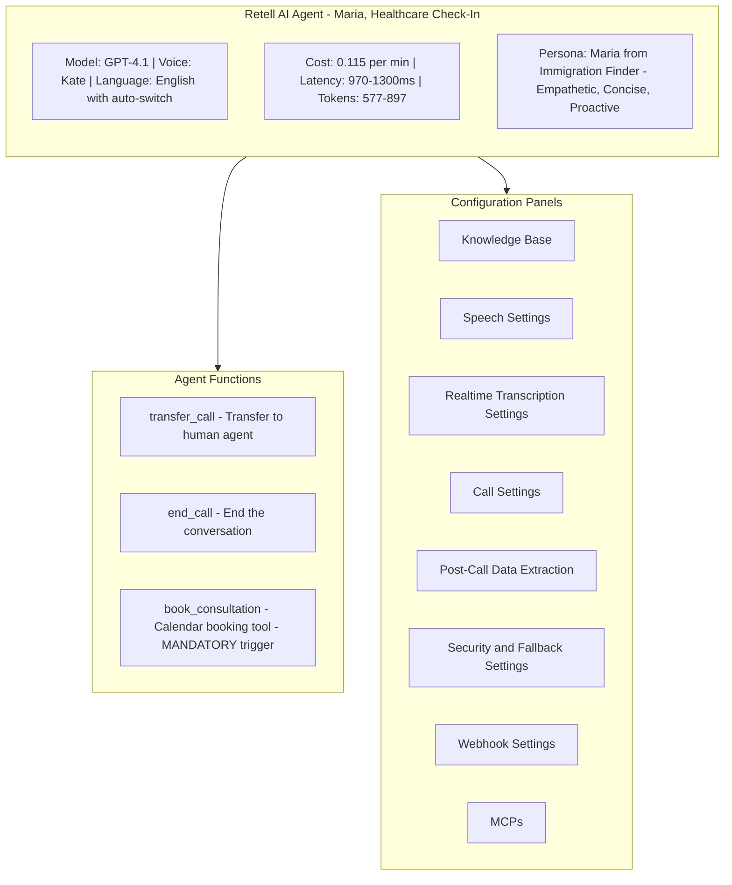
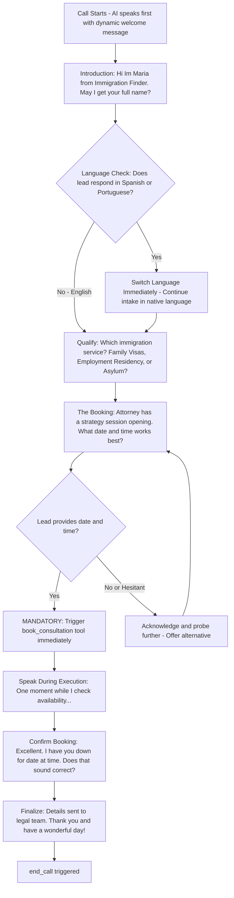
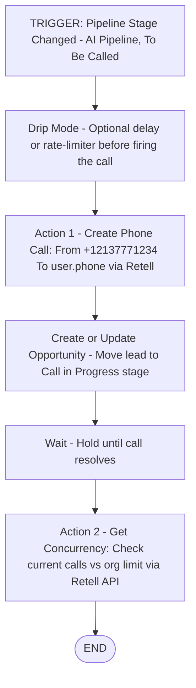
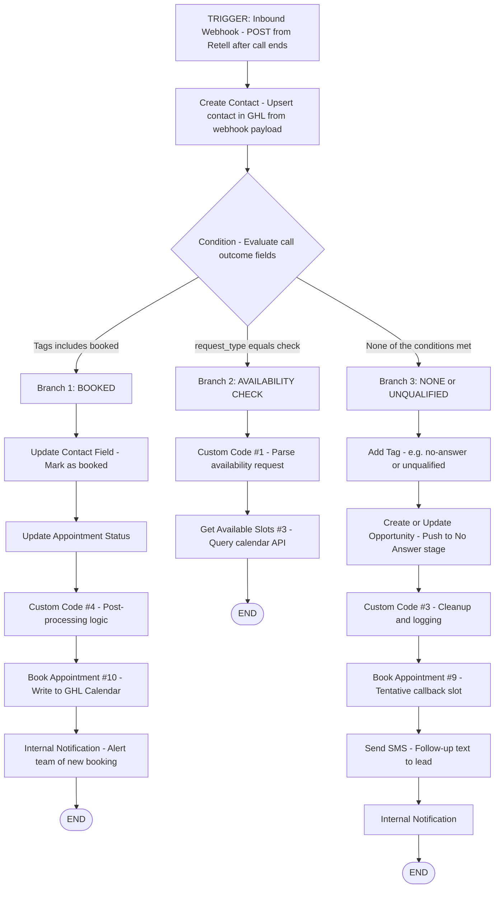
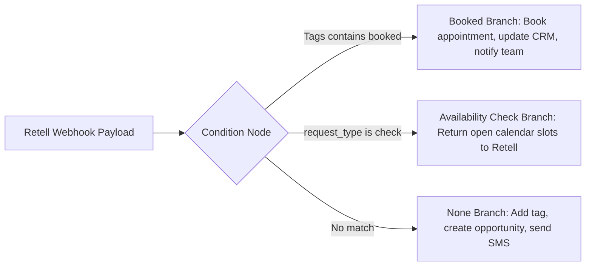
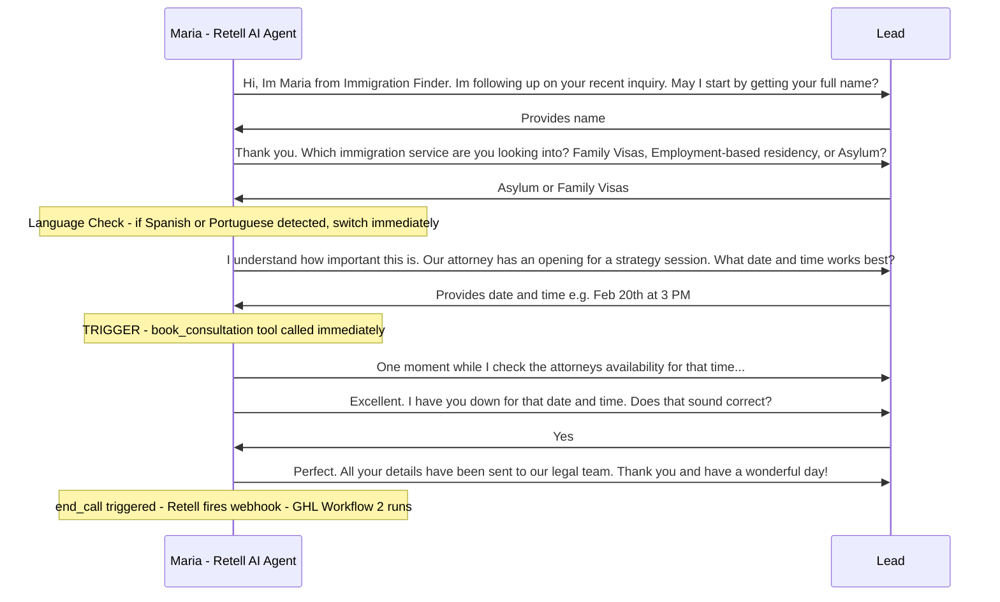
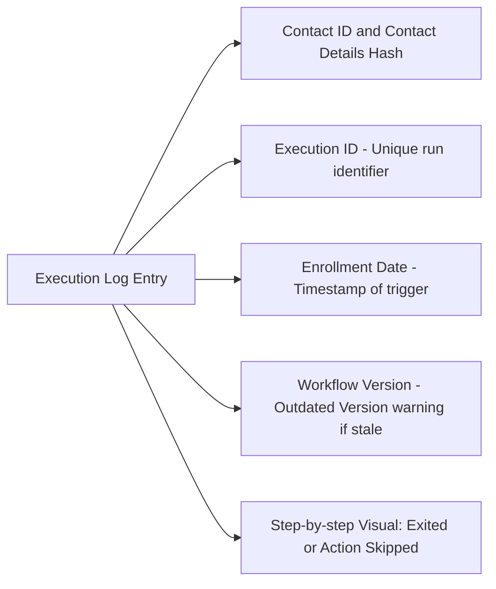
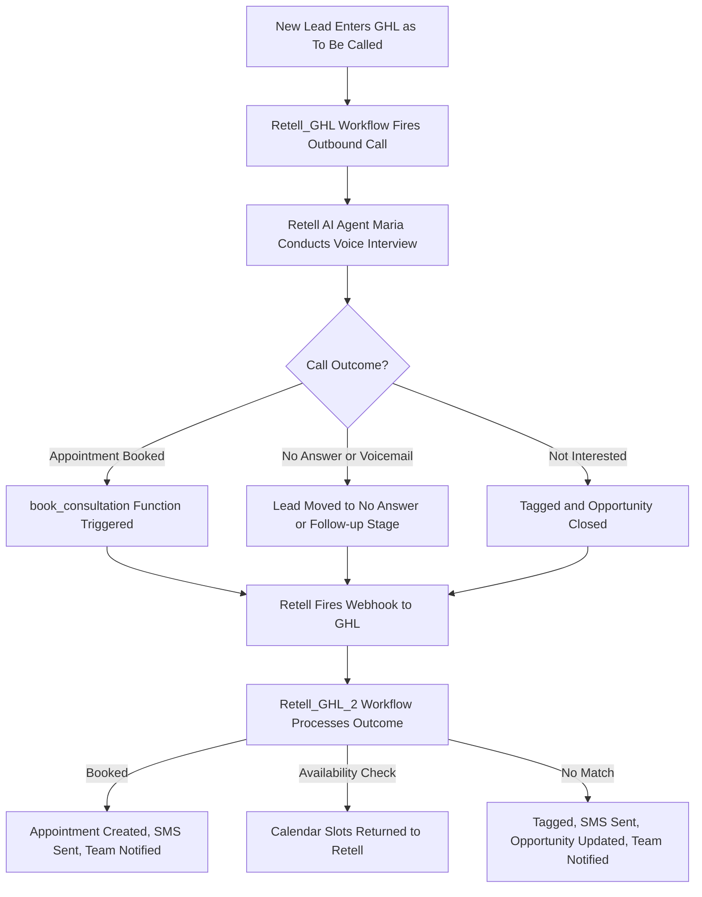

# Retell AI + GoHighLevel (GHL) Integration

A complete guide to understanding and replicating the **Retell AI x GoHighLevel** integration for AI-powered outbound/inbound phone call automation with CRM pipeline management.

---

## Table of Contents

1. [Overview](#overview)
2. [System Architecture](#system-architecture)
3. [GHL Pipeline Setup](#ghl-pipeline-setup)
4. [Retell AI Agent Configuration](#retell-ai-agent-configuration)
5. [Workflow 1 - Retell_GHL Outbound Caller](#workflow-1---retell_ghl-outbound-caller)
6. [Workflow 2 - Retell_GHL_2 Inbound Webhook Handler](#workflow-2---retell_ghl_2-inbound-webhook-handler)
7. [Call Flow - Agent Conversation](#call-flow---agent-conversation)
8. [Execution Logs and Debugging](#execution-logs-and-debugging)
9. [Key Components Reference](#key-components-reference)

---

## Overview

This integration connects **Retell AI** (an AI voice agent platform) with **GoHighLevel (GHL)** (a CRM/automation platform) to automate phone-based lead qualification and appointment booking. The system:

- **Automatically calls** leads when they enter specific CRM pipeline stages
- **Uses an AI agent ("Maria")** to qualify leads, switch languages if needed, and book consultations
- **Writes call outcomes back** to GHL as pipeline stage updates, contact fields, and calendar appointments
- **Handles inbound webhooks** from Retell to process call results in GHL

---

## System Architecture

---

## GHL Pipeline Setup

The **"AI Pipeline"** in GHL tracks leads through the outbound calling funnel. It has **4 stages**:

| Stage | Name | Purpose |
|---|---|---|
| 1 | **To Be Called** | New leads waiting to be contacted |
| 2 | **Call in Progress** | Active/pending call via Retell AI |
| 3 | **Interested / Booked** | Lead converted — appointment scheduled |
| 4 | **No Answer / Follow-up** | No answer, voicemail, or needs retry |

> All stages report to both **Funnel Chart** and **Stage Distribution** in GHL Reports.

---

## Retell AI Agent Configuration

The AI voice agent **"Maria"** is a `Healthcare Check-In` agent built in Retell AI.

### Agent Conversation Flow (Prompt Logic)

---

## Workflow 1 - Retell_GHL Outbound Caller

**Purpose:** Watches for pipeline stage changes in GHL and fires an outbound call via Retell AI.

### Create Phone Call Parameters

| Parameter | Value | Notes |
|---|---|---|
| **Action Name** | Create Phone Call | GHL action label |
| **From Number** | `+12137771234` | Must be a Retell-managed number in E.164 format |
| **To Number** | `{{user.phone}}` | Dynamic — pulled from GHL contact |
| **Override Agent ID** | *(optional)* | One-time override for this call only |
| **Override Agent Version** | *(optional)* | One-time version override |

> **Note:** `Get Concurrency` polls the Retell API to confirm the org has not exceeded its concurrent call limit — a guard against over-dialing.

---

## Workflow 2 - Retell_GHL_2 Inbound Webhook Handler

**Purpose:** Receives webhook POSTs from Retell after a call ends, then branches based on the call outcome.

### Full Workflow — 3-Branch Conditional

### Branch Decision Summary

---

## Call Flow - Agent Conversation

Representative transcript from the live simulation captured in the screenshots:

---

## Execution Logs and Debugging

GHL's **Execution Logs** tab shows the real-time trace of every step executed:

> **Tip:** If you see `Workflow Version When Execution Started: XX (Outdated Version)` in logs, it means the workflow was **updated after** the contact enrolled. Re-publish the workflow and re-enroll the contact to use the latest version.

---

## Key Components Reference

| Component | Platform | Purpose |
|---|---|---|
| **AI Pipeline** | GoHighLevel | 4-stage CRM pipeline tracking lead status |
| **Retell_GHL** (Workflow 1) | GoHighLevel | Outbound call trigger on pipeline stage change |
| **Retell_GHL_2** (Workflow 2) | GoHighLevel | Inbound webhook processor for call outcomes |
| **Maria Agent** | Retell AI | GPT-4.1 voice agent for immigration lead intake |
| **book_consultation** | Retell AI Function | Tool that triggers calendar booking mid-call |
| **transfer_call** | Retell AI Function | Transfers to human agent if needed |
| **end_call** | Retell AI Function | Gracefully ends the AI call |
| **Get Concurrency** | Retell API | Checks current vs. max concurrent call slots |
| **Drip Mode** | GHL | Rate-limits calls to prevent over-dialing |

---

## End-to-End Data Flow Summary

---

*Built using [Retell AI](https://retellai.com) and [GoHighLevel](https://gohighlevel.com)*
